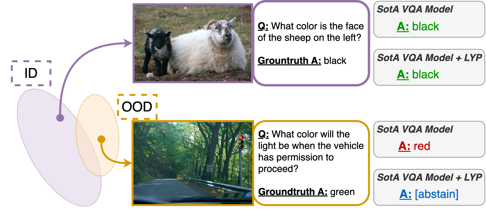

<!--
Copyright (c) Meta Platforms, Inc. and affiliates.
All rights reserved.

This source code is licensed under the license found in the
LICENSE file in the root directory of this source tree.
-->

# OOD Selective VQA

<p align="center">
  
</p>


This is the code for the CVPR 2023 paper [Improving Selective Visual Question Answering by Learning from Your Peers](https://arxiv.org/abs/2306.08751). If you find our paper or this repository useful for your own work, please cite:
```
@inproceedings{dancette2023oodselectivevqa,
  title={Improving Selective Visual Question Answering by Learning from Your Peers},
  author={Dancette, Corentin and Whitehead, Spencer and Maheshwary, Rishabh and Vedantam, Ramakrishna and Scherer, Stefan and Chen, Xinlei and Cord, Matthieu and Rohrbach, Marcus},
  booktitle={Proceedings of the Conference on Computer Vision and Pattern Recognition (CVPR)},
  year={2023}
}
```

## Downloading data

- Download the COCO train2014 + val2014 images from https://cocodataset.org/#download.
- Download the VQA split files from [Whitehead et al. (2022)](https://dl.fbaipublicfiles.com/reliablevqa/data/reliable_vqa-annotations.tar.gz) and place them in the `datasets/vqa2` folder.
- Download the trainval_ans2label.pkl file from [https://github.com/OFA-Sys/OFA/issues/68#issuecomment-1096837349](https://github.com/OFA-Sys/OFA/issues/68#issuecomment-1096837349) and place it in `datasets/vqa2`.
- Download the original VQA2 annotations and place them in `datasets/vqa2`.
- For OOD evaluation, download the [AdVQA data](https://adversarialvqa.org/download.html) and place the json files in `datasets/advqa`.
- Download pre-trained checkpoints from the [OFA-Sys repository](https://github.com/OFA-Sys/), and place them in the `checkpoints/` directory.

## Data processing

Run `bash lyp_scripts/convert_data.sh <COCO_IMG_ROOT>`

## Installation
Follow instructions from the [OFA-Sys repository](https://github.com/OFA-Sys/) for installation and dependencies.


## Checkpoints

<table>
    <thead>
        <tr>
            <th></th>
            <th>MaxProb (A+B)</th>
            <th>Selector (B)</th>
            <th>LYP</th>
        </tr>
    </thead>
    <tbody>
        <tr>
            <td>OFA-Base</td>
            <td align="center"><a href="https://dl.fbaipublicfiles.com/selectivevqa_ood/models/ofab_maxprob_ab.pt">download</a></td>
            <td align="center"><a href="https://dl.fbaipublicfiles.com/selectivevqa_ood/models/ofab_selector_b.pt">download</a></td>
            <td align="center"><a href="https://dl.fbaipublicfiles.com/selectivevqa_ood/models/ofab_lyp.pt">download</a></td>
        </tr>
        <tr>
            <td>OFA-Large</td>
            <td align="center"><a href="https://dl.fbaipublicfiles.com/selectivevqa_ood/models/ofal_maxprob_ab.pt">download</a></td>
            <td align="center"><a href="https://dl.fbaipublicfiles.com/selectivevqa_ood/models/ofal_selector_b.pt">download</a></td>
            <td align="center"><a href="https://dl.fbaipublicfiles.com/selectivevqa_ood/models/ofal_lyp.pt">download</a></td>
        </tr>
    </tbody>
</table>


## Training VQA models

Training scripts for VQA models (OFA-Base and OFA-Large) are located in `run_scripts/vqa`.

We provide scripts to train VQA models.

- Single model on the VQA v2 training set: `run_scripts/vqa/train_vqa_base_distributed_vqatrain2014.sh`
- Single model on the VQA v2 train+dev set: `run_scripts/vqa/train_vqa_base_distributed_vqatraindev.sh`
- 10 models on 90% of the VQA v2 train+dev set: `run_scripts/vqa/train_vqa_base_distributed_traindev_10models_90pc_loop.sh`. You may need to modify the script if you use a scheduler like slurm, or if you want to run all trainings concurrently.

## Training selectors

### Selector on top of OFA-Base train

The script is located at `run_scripts/vqa_selector/train_base_selector-dev_emainit_img_text_prob_foe.sh`. It will train the selector on our `dev` set.

### Selector on top of OFA-Base train+dev model

First, eval your train+dev model on the train+dev set using `bash eval_ema.sh vqa2-traindev <ckpt_path> datasets/vqa2/imdb_val2014-traindev.valformat.tsv`

Then, create a selector training file, using 

```
python lyp_scripts/add_conf_labels.py \
--original_train datasets/vqa2/imdb_val2014-traindev.valformat.tsv \
--predictions_path <predictions_path> \
--out datasets/vqa2/traindev-selflabeled.tsv
```

Then, you can train the selector using the script located at `run_scripts/vqa_selector/train_base_selector-traindev-selflabeled_emainit_img_text_prob_foe.sh`

### Selector with LYP

First, evaluate the 10 models with this script
`bash lyp_scripts/lyp_10_eval.sh`

This will save predictions on the 10 held-out subsets.

Then, create the new selector training file with this command: `bash lyp_scripts/lyp_10_create_selector_training.sh`

Finally, to train the final selector, use the script at `run_scripts/vqa_selector/train_base_selector-traindev-LYP-10_emainit_img_text_prob_foe.sh`


## Selector Evaluation

You can use the following scripts to run an inference and get the predictions:

#### For the base model,

Run from run_scripts/vqa
```bash
bash eval_ema.sh <dataset_name> <ckpt_path> <dataset_path>
```

#### For the selectors

From run_scripts/vqa_selector, run
```bash
bash eval_noema.sh <dataset_name> <ckpt_path> <dataset_tsv_path>
```

This will create a folder in the checkpoint directory named <dataset_name>

### Get evaluation metrics

Our evaluation scripts are based on the [Reliable VQA](https://github.com/facebookresearch/reliable_vqa/tree/main/eval_scripts) scripts. To get the final evaluation, on the VQA v2 in-distribution testing set:

```python
python eval/run.py \
-q <vqa_questions json> \
-a <vqa_annotations json> \
-p <predictions_vqa json>
```

For mixtures of in-distribution and out-of-distribution, first eval the model on both VQA v2 testing sets and AdVQA testing set.
Then, use the following command:

```python
python eval/run.py \
-q <vqa_questions json> \
-a <vqa_annotations json> \
-p <predictions_vqa json> \
--advqa-questions <advqa_questions> \
--advqa-annots <advqa_annots> \
--predictions-advqa <predictions_advqa> \
--mixture-qids datasets/mixtures/<mixture.json>
```

#### Threshold selection on the validation set

Use the `run_threshold.py` script with the additional flag `--predictions-val`. The other parameters are the same.

```
python eval/run_threshold.py \
-q <vqa_questions json> \
-a <vqa_annotations json> \
-p <predictions_vqa json> \
--predictions-val <predictions_val json> \
--advqa-questions <advqa_questions> \
--advqa-annots <advqa_annots> \
--predictions-advqa <predictions_advqa> \
--mixture-qids datasets/mixtures/<mixture.json>
```

## License

The majority of OOD Selective VQA is licensed under CC-BY-NC (see [LICENSE](LICENSE)), however portions of the project are available under separate license terms: [eval/vqa.py](eval/vqa.py) as well as [eval/reliable_vqa_eval.py](eval/reliable_vqa_eval.py), which are modified from [vqa.py](https://github.com/GT-Vision-Lab/VQA/blob/master/PythonHelperTools/vqaTools/vqa.py) and [vqaEval.py](https://github.com/GT-Vision-Lab/VQA/blob/master/PythonEvaluationTools/vqaEvaluation/vqaEval.py) in https://github.com/GT-Vision-Lab/VQA, are licensed under the BSD 2-Clause License. OFA is licensed under the Apache License 2.0.
